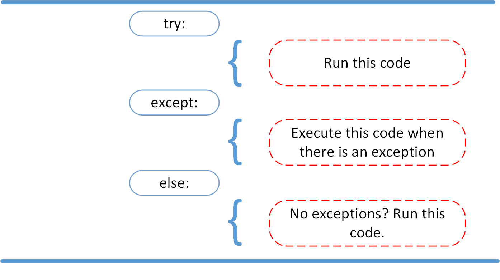

## Exception

* An event that happens during the execution of a program that changes the program flow.

* These needs to be handled using try and catch blocks in code.

**Example:**

*FloatingPointError*

This is a exception that occurs when operation involving floating point fails

Go back to [README](README.md)