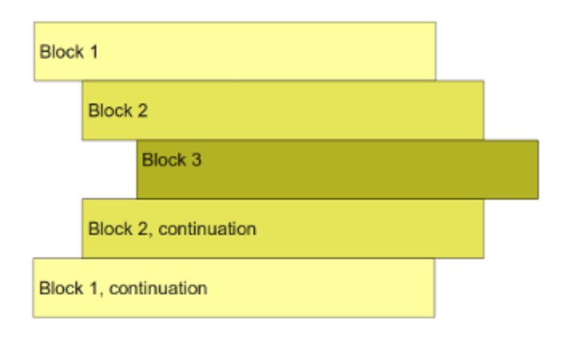

## Python Indentation

* Python programs are structured through indentation, i.e. code blocks are defined by their indentation. 

* In Python it is a language requirement not a matter of style. 

* All statements with the same distance to the right belong to the same block of code, i.e. the statements within a block line up vertically. 

* The block ends at a line less indented or the end of the file.

* If a block has to be more deeply nested, it is simply indented further to the right. 

Go back to [README](README.md)