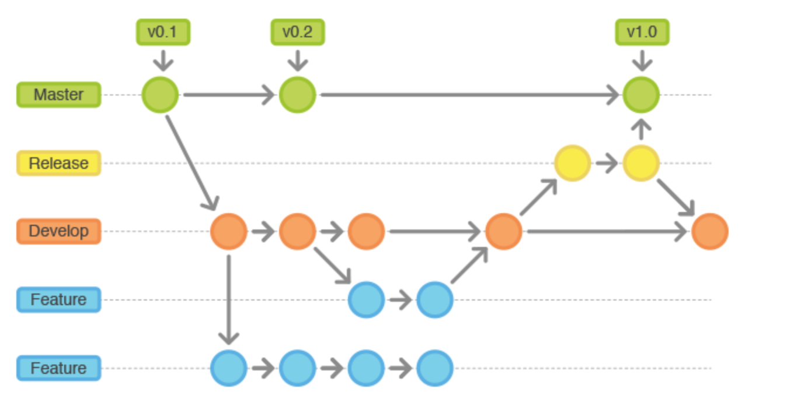

## Master Branch

* **Master Branch** is the default branch of the [repository](repository.md).
* Generally, the master branch is used to deploy in production.
* When someone wants to add code, they would [branch](branch.md) off of the master, then do their changes in the new branch. Once they are done, they would [merge](merge.md) this branch with master, after they have made sure the changes are correct.
* In essence, the master branch can be thought of as the official working version of the project.

Go back to [README](README.md)
