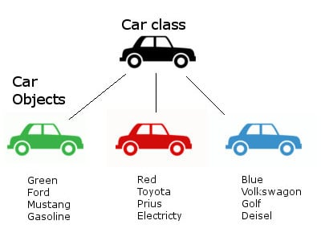

## Objects

* While the [class](Class.md) is the blueprint, an instance is a copy of the class with actual values.
* For example, a class is like a form or questionnaire. It defines the needed information. After you fill out the form, your specific copy is an instance of the class; it contains actual information.
* You can fill out multiple copies to create many different instances, but before you can create individual instances of an object, you must first specify what is needed by defining a class.

Go back to [README](README.md)
