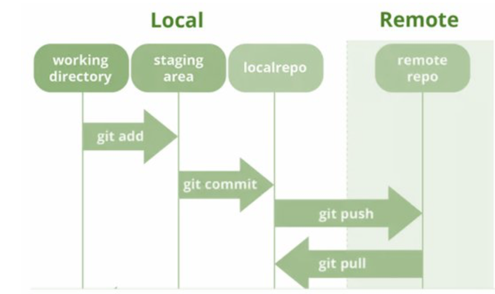

## Pull

* A **Pull** is used to transfer the changes made on a remote [repository](repository.md) onto your local repository. 
* If you [forked](fork.md) a repo, and your friend made changes to the original repo that you want to download on your local, you can use the git pull command. You first have to add the original/your friend's repo via git [remote](remote.md) add. 
* After you use the git pull command, you can view the changes that your friend made onto your local repository.
* Fun fact: A Pull is really a combination of git fetch and git [merge](merge.md).

Go back to [README](README.md)
