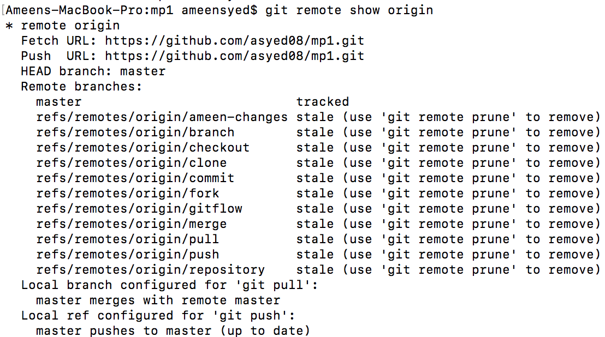

## Remote

* **Remote** commands in git have to do with the remote [repository](repository.md). 
* A remote repository is a version of your project that is hosted on the internet or network somewhere.
* There are 3 main commands to use with remote:
1. *git remote add* - This is used to add a remote repository. After typing git remote add, you can type the name of the repository to refer it to in git, and the URL of the repository.
1. *git remote remove* - This is used to remove a remote repository. After typing git remote remove, you can type the name of the repository in order to remove the reference to the remote repository.
1. *git remote show* - This is used to inspect a remote repository. After typing git remote show, you can type the name of the repository you want to inspect. It will then show the following information:

Go back to [README](README.md)
