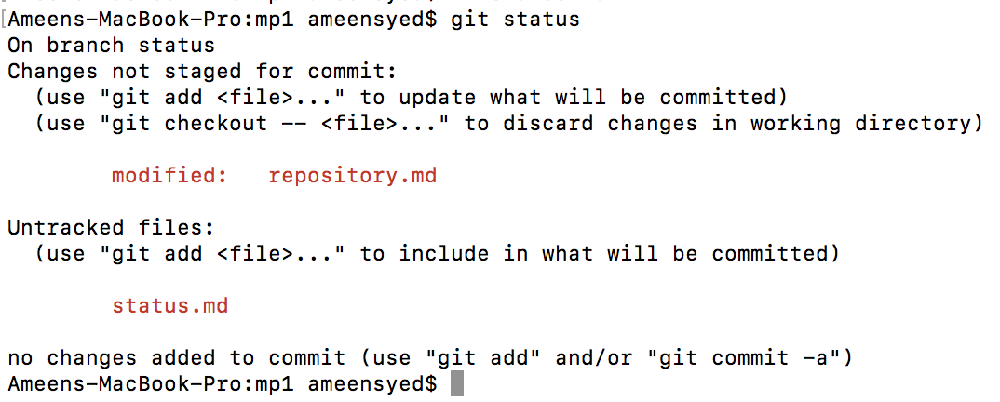

## Status

* **Status** command is used to display the state of the working directory and the staging area.
* It lets you see which changes have been staged, which haven't, and which files aren't being tracked by Git.
* Note: For checking committed project history, git status is not the correct command. For this, you would need to use git log.

Go back to [README](README.md)
